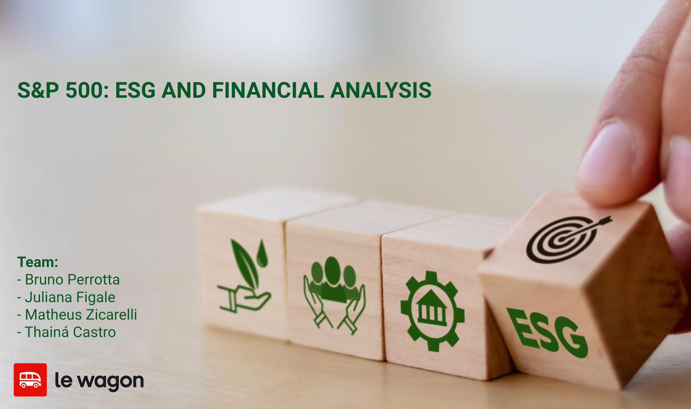

# [S&P 500: ESG and Financial Analysis](https://lookerstudio.google.com/reporting/140477a4-3273-4e43-bd81-9bde03abfdc5)

A shared project that provides insights on the relationship between the financial performance of companies listed in the S&P 500 and ESG risks.

The "S&P 500 and Financial Analysis" project assesses the ESG risks of 401 out of the 500 largest companies listed on the US stock exchange in relation to their financial performance. 
Its target audience is investors, particularly companies interested in the benefits of good ESG practices.

The main project deliverables are:
1) Identification of a new metric: companies' confidence level;
2) Trend analysis and financial health based on the confidence level;
3) Financial recommendations to a client based on their investment profile.

The primary data sources for the project are Kaggle, Sustanalytics, and Yahoo Finance.
The ELT pipeline was managed with Google Sheets, SQL, and Python.
